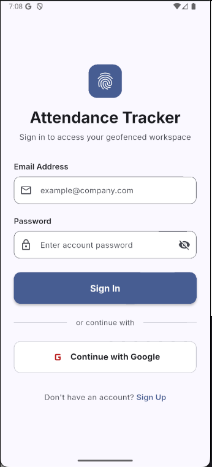
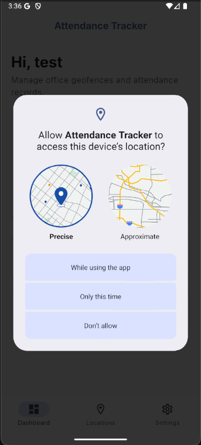
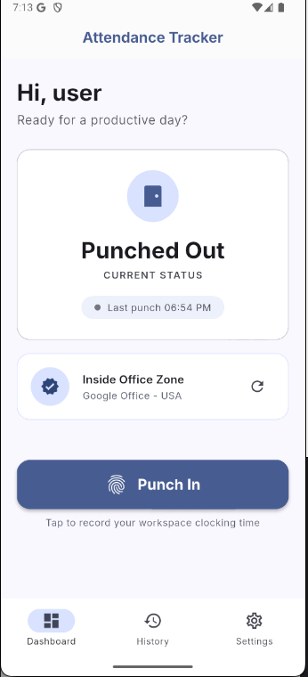
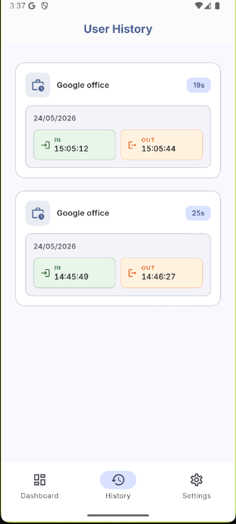
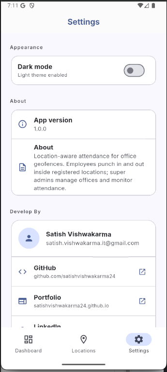
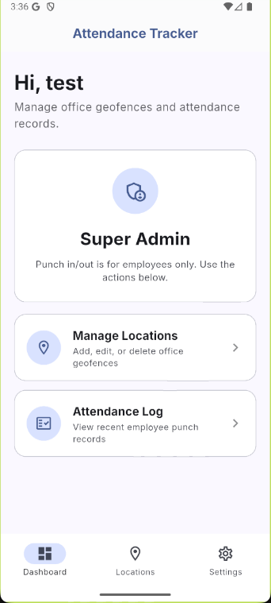
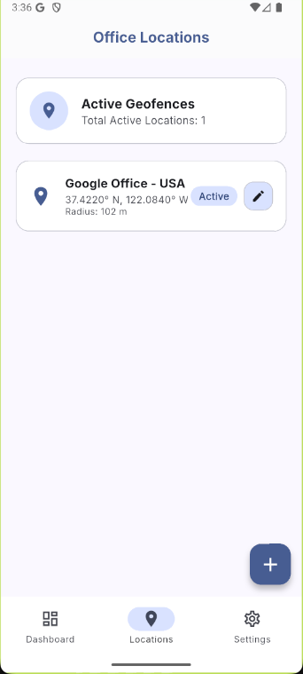
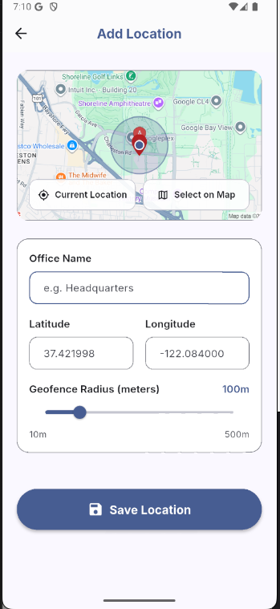
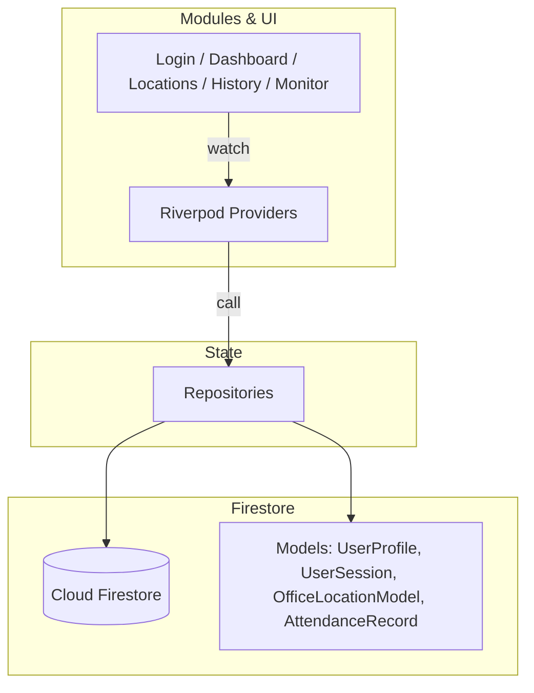

# 📍 Attendance Tracker (WorkSync)

A location-aware attendance app built with **Flutter**, **Riverpod**, **GoRouter**, and **Firebase**.

Employees punch in and out only when inside a registered office geofence. **Super admins** manage office locations (CRUD) and monitor organization-wide attendance in real time.

> **Status:** MVP complete — auth, geofenced punch, location CRUD, employee history, and admin attendance log are implemented.

---

## Screenshots

### Authentication & permissions

| Login | Location permission |
| :---: | :---: |
|  |  |

### Employee

| Dashboard | Punch history | Settings |
| :---: | :---: | :---: |
|  |  |  |

### Super Admin

| Admin dashboard | Office locations | Add location |
| :---: | :---: | :---: |
|  |  |  |

---

## Key Features

| Role | Capabilities | Core Workflows |
| :--- | :--- | :--- |
| **Employee** | Secure auth · Geofencing · Session history · Dark mode | Sign in with email/password or Google. View geofence status (inside/outside + distance). Punch in/out only inside an active office radius. Review past sessions with color-coded IN/OUT times and duration. |
| **Super Admin** | Location CRUD · Attendance monitor · No punch UI | Add/edit/delete office geofences (name, lat, lng, radius). View live attendance log (latest 50 records). Each card groups a user's punch-in and punch-out in one session. |

### Geofencing

Uses `geolocator` via `GeofenceService` (`lib/core/utils/geofence_service.dart`):

- **Inside zone** — punch button enabled
- **Outside zone** — punch disabled; UI shows nearest office and distance in meters

### Attendance history UI

- **Employee (User History)** — one card per work session; green **IN** / orange **OUT** times on a single row with shared date (`dd/MM/yyyy` + `HH:mm:ss`)
- **Super Admin (Attendance Log)** — raw punch records grouped into in/out sessions per user; avatar, email, location, duration chip, and the same color-coded time bar
- **Live location names** — history resolves the current office name from `locations/{id}` (stored `locationName` in `sessions`/`attendance` is a snapshot at punch time)

---

## Architecture

Feature-first layout with repositories owning all Firestore access and Riverpod providers exposing state to widgets.



### Directory structure

```text
lib/
├── config/           # AppConfig, GoRouter, Firebase providers
├── core/
│   ├── theme/        # Material 3 theme, punch IN/OUT colors, context extensions
│   ├── utils/        # Logger, geofence, location permissions
│   └── widgets/      # Shared UI (e.g. PunchSessionTimesBar)
├── data/
│   ├── models/
│   └── repositories/ # Auth, attendance, sessions, locations
├── modules/
│   ├── auth/         # Login, sign-up, Google Sign-In
│   ├── dashboard/    # Punch flow, geofence status cards
│   ├── location/     # Admin location list & add/edit
│   ├── admin/        # Attendance monitor (grouped session cards)
│   └── common/       # App shell, nav bar, user history, settings
├── app.dart
└── main.dart
```

---

## Firestore data model

### `users/{uid}`

```json
{
  "email": "employee@example.com",
  "displayName": "Jane Doe",
  "role": "employee",
  "createdAt": "Timestamp"
}
```

Roles: `employee` | `super_admin`

### `locations/{locationId}`

```json
{
  "name": "Google Office - USA",
  "latitude": 37.421998,
  "longitude": -122.084,
  "radiusMeters": 100.0,
  "isActive": true,
  "createdBy": "admin-uid",
  "createdAt": "Timestamp"
}
```

### `attendance/{recordId}`

Raw punch events (one document per in or out).

```json
{
  "userId": "user-uid",
  "userEmail": "employee@example.com",
  "locationId": "location-uid",
  "locationName": "Google Office - USA",
  "type": "in",
  "timestamp": "Timestamp",
  "lat": 37.421998,
  "lng": -122.084
}
```

### `sessions/{sessionId}`

Completed work interval, written on punch out (powers User History).

```json
{
  "userId": "user-uid",
  "locationId": "location-uid",
  "locationName": "Google Office - USA",
  "punchInAt": "Timestamp",
  "punchOutAt": "Timestamp",
  "durationSeconds": 28800,
  "isActive": false,
  "punchInAttendanceId": "attendance-record-uid"
}
```

> **Note:** `locationName` in `attendance` and `sessions` is denormalized at punch time. Renaming a location in `locations` does not rewrite old records; the app resolves the live name by `locationId` when displaying history.

---

## Security rules

Defined in `firestore.rules`:

| Collection | Read | Write |
| :--- | :--- | :--- |
| `users` | Own profile; super admin reads all | User creates own doc as `employee`; super admin can update roles |
| `locations` | Any signed-in user | Super admin only |
| `attendance` | Own records; super admin reads all | Create own punches only; no update/delete |
| `sessions` | Own sessions; super admin reads all | Create own completed session on punch out; no update/delete |

Deploy:

```bash
npx -y firebase-tools@latest deploy --only firestore
```

---

## Getting started

### Prerequisites

- Flutter SDK `>=3.3.0 <4.0.0`
- Node.js (Firebase CLI)
- Android Studio / Xcode for device or emulator

### 1. Install

```bash
git clone <repository-url>
cd attendance_tracker
flutter pub get
```

### 2. Firebase setup

```bash
npx -y firebase-tools@latest login
dart pub global activate flutterfire_cli
export PATH="$PATH:$HOME/.pub-cache/bin"

flutterfire configure --project=attendance-tracker-demo-app --yes --platforms=android
# iOS: register app in Firebase Console, then add --platforms=ios
```

### 3. Authentication

Enable **Email/Password** and **Google** in Firebase Console → Authentication → Sign-in method.

**Email / password**

1. Tap **Sign Up**, enter email + password (min 6 chars).
2. A `users/{uid}` document is created with `role: employee`.

**Google Sign-In (Android)**

1. Package: `com.satishvishwakarma.attendance_tracker.demo`
2. Add debug SHA-1 in Firebase → Project settings → Android app → Add fingerprint:
   `9B:97:6A:9E:05:10:52:D7:A8:78:9B:2C:AD:37:79:C9:DD:29:C2:5C`
3. Re-run `flutterfire configure` and confirm `google-services.json` has an OAuth client with `client_type: 1`.
4. Set `AppConfig.googleWebClientId` in `lib/config/constant/app_config.dart` to your Web client ID from Firebase Authentication → Google.

**Generate SHA fingerprints**

```bash
cd android && ./gradlew signingReport
```

---

## Device configuration

### Android

`android/app/src/main/AndroidManifest.xml`:

```xml
<uses-permission android:name="android.permission.ACCESS_FINE_LOCATION" />
<uses-permission android:name="android.permission.ACCESS_COARSE_LOCATION" />
```

### iOS

`ios/Runner/Info.plist`:

```xml
<key>NSLocationWhenInUseUsageDescription</key>
<string>This application requires access to your location to verify your presence within the registered office geofences.</string>
```

```bash
cd ios && pod install && cd ..
```

---

## Run & test

```bash
npx -y firebase-tools@latest deploy --only firestore
flutter run
```

### Seed a super admin

1. Register via the app (email or Google).
2. Firebase Console → Firestore → `users/<your-uid>`.
3. Change `role` from `employee` to `super_admin`.
4. Sign out and back in — admin dashboard, **Locations**, and **Attendance Log** unlock.

### Demo checklist

- [ ] Super admin adds a location in Firestore / Locations screen
- [ ] Employee punches in only inside geofence radius
- [ ] Employee punches out and sees session in User History
- [ ] Super admin sees grouped in/out cards in Attendance Log
- [ ] Renamed location shows updated name in history (live lookup)
- [ ] Security rules deny cross-user writes

---

## Tech stack

| Area | Package |
| :--- | :--- |
| State | `flutter_riverpod` |
| Routing | `go_router` |
| Backend | `firebase_core`, `firebase_auth`, `cloud_firestore` |
| Location | `geolocator`, `permission_handler` |
| UI | Material 3, `google_fonts` (Inter), `flutter_screenutil` |
| Logging | `talker` via `lib/core/utils/logger.dart` |

---

## Development conventions

- **Theme** — colors and styles in `lib/core/theme/app_theme.dart` only; use `context.colors` and `context.textStyles`
- **Punch colors** — `ColorScheme.punchIn` / `punchOut` extensions for IN/OUT UI
- **Logging** — use `Logger` from `lib/core/utils/logger.dart`; never `print` / `debugPrint`
- **Data access** — widgets → providers → repositories; no Firestore calls in `build()`
- **Shared widgets** — reusable pieces under `lib/core/widgets/`

---

## License

Private project for review only.