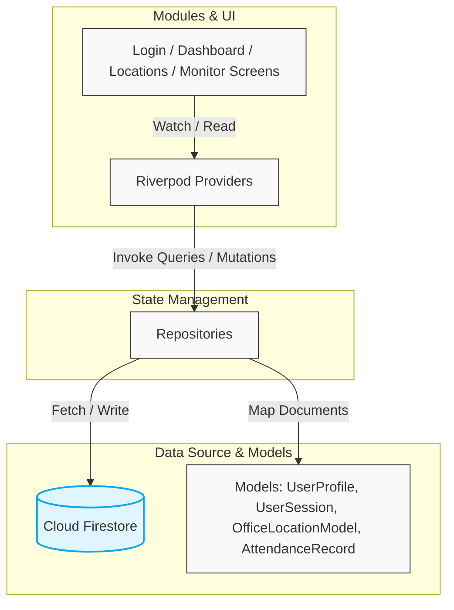

# 📍 Attendance Tracker (WorkSync)

A premium, location-aware attendance tracking application built with **Flutter**, **Riverpod (State Management)**, **GoRouter (Routing)**, and **Firebase**. 

Employees can punch in and out only when they are physically inside registered office geofences. **Super Admins** have a dedicated view where they can manage office locations (CRUD operations) and monitor real-time attendance logs for the entire organization.

> 📊 **MVP Progress:** ~85% complete. For the full status and active checklist, see [mvp-tracker.md](mvp-tracker.md).

---

## 🌟 Key Features

| Role | Capabilities | Core Workflows |
| :--- | :--- | :--- |
| **Employee** | • Secure Authentication<br>• Real-time Geofencing<br>• Session History | • Sign in with Email/Password or Google Sign-In.<br>• View current geofence status (Inside/Outside office radius).<br>• Punch In/Out when inside the active radius of any office.<br>• View past attendance sessions and active work hours. |
| **Super Admin** | • Office Management (CRUD)<br>• Attendance Monitoring<br>• Administrative Immunity | • Dynamic CRUD controls for registered locations (name, lat, lng, radius).<br>• View all employee attendance logs in real time (up to 50 records).<br>• Excluded from punching in/out (no punch UI on admin accounts). |

### 🧭 Dynamic Geofencing Logic
The geofencing mechanism leverages the `geolocator` package under a centralized `GeofenceService` (`lib/core/utils/geofence_service.dart`). It continuously evaluates the user's current GPS coordinates against all active office locations.
- **Inside Zone**: The "Punch In/Out" action is fully enabled.
- **Outside Zone**: The button is safely disabled, and the UI displays the nearest office location along with the remaining distance in meters.

---

## 📐 Architecture & Project Flow

The app follows a **Feature-First / Clean Architecture Hybrid** designed for scalability, complete testability, and separation of concerns.



### 📂 Directory Structure

```text
lib/
├── config/                  # Global application configurations
│   ├── constant/            # AppConfig, constant values
│   ├── routes/              # GoRouter setup, Route guards, navigation stack
│   └── services/            # Firebase provider setups
├── core/                    # Core shared components (Theme, Utilities)
│   ├── firebase/            # Firebase base setup providers
│   ├── theme/               # Material 3 dark/light palettes, BuildContext extensions
│   └── utils/               # Talker logger, Geofencing, Location permissions
├── data/                    # Data models and Firebase repositories
│   ├── models/              # Type-safe models (UserProfile, UserSession, etc.)
│   └── repositories/        # Repositories executing Firestore operations
├── modules/                 # Feature-based presentation folder
│   ├── auth/                # Login, email register, and Google Sign-In widgets
│   ├── dashboard/           # Employee/Admin landing screen, Punch button, geofencing cards
│   ├── location/            # Admin office management, interactive radius configuration
│   ├── admin/               # Organization-wide live attendance monitor
│   └── common/              # Shared shell, app-bars, user history & settings screens
├── app.dart                 # App widget routing setup
└── main.dart                # Native binding, splash dismissal & initialization entrypoint
```

---

## 💾 Firestore Data Model

The application uses an extremely secure, structured Cloud Firestore layout.

### `users/{uid}`
Stores profile details and security roles.
```json
{
  "email": "employee@worksync.com",
  "displayName": "Jane Doe",
  "role": "employee", // Options: 'employee' | 'super_admin'
  "createdAt": "Timestamp"
}
```

### `locations/{locationId}`
Configurable office fences created by Super Admins.
```json
{
  "name": "Headquarters",
  "latitude": 37.421998,
  "longitude": -122.084000,
  "radiusMeters": 100.0,
  "isActive": true,
  "createdBy": "admin-uid",
  "createdAt": "Timestamp"
}
```

### `attendance/{recordId}`
Raw transactional records representing physical check-ins and check-outs.
```json
{
  "userId": "user-uid",
  "userEmail": "employee@worksync.com",
  "locationId": "location-uid",
  "locationName": "Headquarters",
  "type": "in", // Options: 'in' | 'out'
  "timestamp": "Timestamp",
  "lat": 37.421998,
  "lng": -122.084000
}
```

### `sessions/{sessionId}`
Calculated and consolidated working intervals recorded upon successful check-out. Used for displaying individual work history.
```json
{
  "userId": "user-uid",
  "locationId": "location-uid",
  "locationName": "Headquarters",
  "punchInAt": "Timestamp",
  "punchOutAt": "Timestamp",
  "durationSeconds": 28800,
  "isActive": false,
  "punchInAttendanceId": "attendance-record-uid"
}
```

---

## 🛡️ Security Rules & Indexes

Database access is protected by granular security checks defined in `firestore.rules`. 

### Security Highlights
- **Users**: Read/Write only allowed for their own profile, except Super Admins who can read all user records.
- **Locations**: Read allowed for all authenticated users. Create/Update/Delete exclusively allowed for `super_admin` accounts.
- **Attendance / Sessions**: Read/Create restricted to the individual owner. Updates and deletes are completely blocked for everyone (`allow update, delete: if false`).

Deploying rules and indexes:
```bash
npx -y firebase-tools@latest deploy --only firestore
```

---

## 🚀 Getting Started

### 📋 Prerequisites
- **Flutter SDK**: `sdk: '>=3.3.0 <4.0.0'`
- **Node.js** (required to run Firebase CLI commands)
- **Android Studio** (Android emulator/device) or **Xcode** (iOS simulator/device)

### 1. Installation
Clone the repository and fetch the dependencies:
```bash
git clone <repository-url>
cd attendance_tracker
flutter pub get
```

### 2. Firebase Project Association & Setup
Initialize Firebase using standard tools:
```bash
# 1. Login to Firebase CLI
npx -y firebase-tools@latest login

# 2. Activate Flutterfire globally (if not already done)
dart pub global activate flutterfire_cli

# 3. Configure platforms
flutterfire configure --project=attendance-tracker-demoapp
```

### 3. Google Sign-In Configurations

To ensure Google Sign-In works seamlessly across targets, configure the SHA credentials:

#### Android SHA Configuration
1. Generate your SHA signatures from your local machine:
   ```bash
   cd android
   ./gradlew signingReport
   ```
2. Copy the **SHA-1** and **SHA-256** keys from the console output.
3. Open your project on the [Firebase Console](https://console.firebase.google.com).
4. Navigate to **Project Settings** → **Your Apps** → **Android App**.
5. Click **Add fingerprint** and add both SHA-1 and SHA-256 certificates.
6. Re-download `google-services.json` or run `flutterfire configure` again to synchronize the OAuth clients.
7. Note: The app relies on the Google Web Client ID for cross-platform authentication. You can optionally modify `AppConfig.googleWebClientId` in `lib/config/constant/app_config.dart` with your Web Client ID from the console's Authentication credentials if needed.

---

## 🛡️ Device & Platform Configuration

The app requires standard location permissions to compute geofence metrics.

### 📱 Android Requirements
The required permissions are already added to `android/app/src/main/AndroidManifest.xml`:
```xml
<uses-permission android:name="android.permission.ACCESS_FINE_LOCATION" />
<uses-permission android:name="android.permission.ACCESS_COARSE_LOCATION" />
```

### 🍏 iOS Requirements
1. The permission description is defined in `ios/Runner/Info.plist`:
   ```xml
   <key>NSLocationWhenInUseUsageDescription</key>
   <string>This application requires access to your location to verify your presence within the registered office geofences.</string>
   ```
2. In `ios/Podfile`, make sure the location permission macro is enabled:
   ```ruby
   ## Setup permission handler variables
   # target.build_configurations.each do |config|
   #   config.build_settings['GCC_PREPROCESSOR_DEFINITIONS'] ||= ['$(inherited)', 'PERMISSION_LOCATION=1']
   # end
   ```
3. Run dependency installation:
   ```bash
   cd ios
   pod install
   cd ..
   ```

---

## 🏃 Running & Testing the App

1. Deploy the Firestore security rules and configuration index settings:
   ```bash
   npx -y firebase-tools@latest deploy --only firestore
   ```
2. Run on a connected physical device or simulator:
   ```bash
   flutter run
   ```
3. **Become a Super Admin**:
   - Register a new user account via the app's Email Sign Up or Google Sign-In.
   - Open your project on the [Firebase Console](https://console.firebase.google.com).
   - In Firestore, locate your user document under the `users` collection (`users/<your-uid>`).
   - Edit the `role` field from `employee` to `super_admin`.
   - Re-open the app (or log out and back in). The **Admin Dashboard**, **Location Settings**, and **Organization Monitor** features will now be fully unlocked!

---

## 🎨 Development & Styling Conventions

- **Modern Theme System**: We leverage a specialized Material 3 color system configured in `lib/core/theme/app_theme.dart`. Developers should retrieve style tokens using the custom `BuildContext` extensions:
  - `context.colors` to fetch the themed `ColorScheme`.
  - `context.textStyles` to retrieve `GoogleFonts.lato`-powered text settings.
- **Centralized Logs**: Do not use `print` or `debugPrint`. Use our customized `Logger` based on the `talker` library (`lib/core/utils/logger.dart`) to capture clean, structured diagnostic output.
- **State Management Pattern**: Strictly use Riverpod Notifiers for business/screen states. Never inject queries directly into widgets; always route Firestore reads and writes through Repository classes defined under `lib/data/repositories/`.

---

## 📄 License
This project is private and intended solely for review and interview evaluations.
